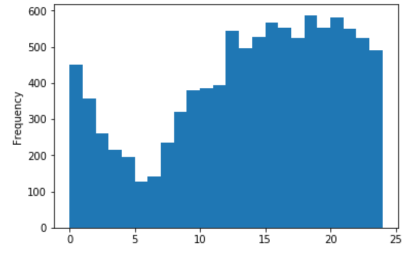
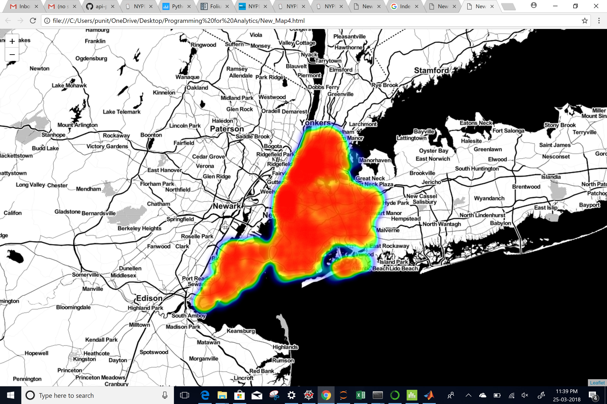
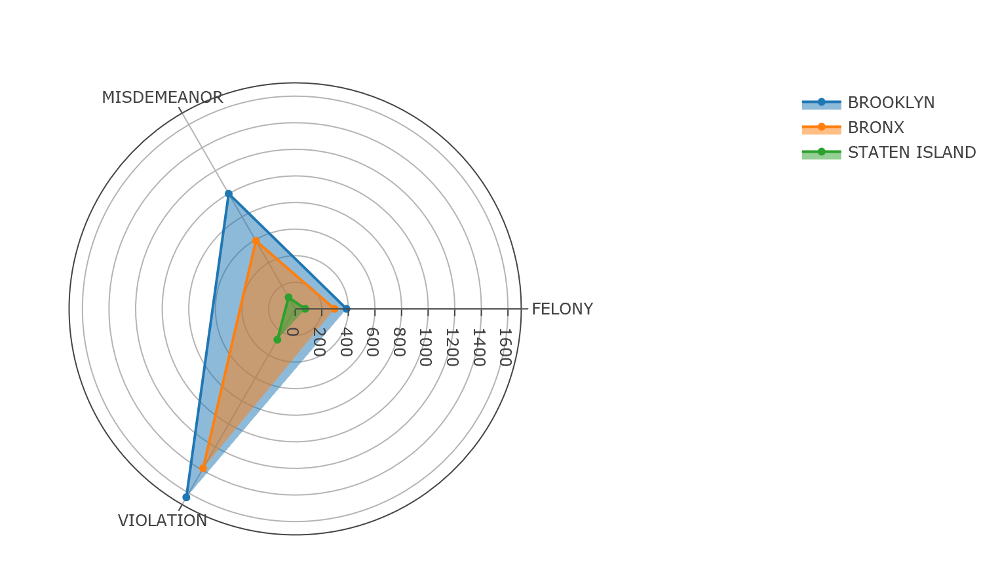
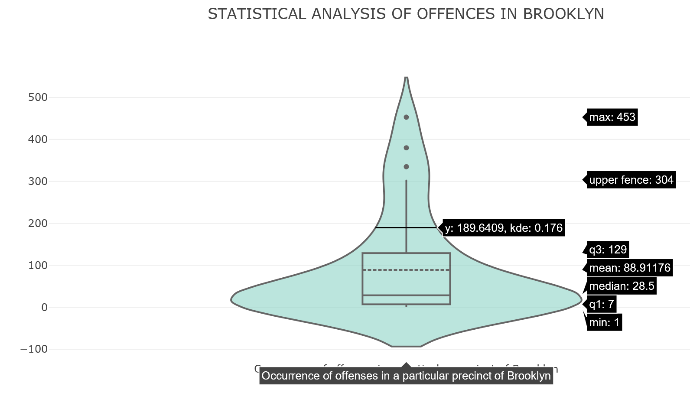

# An exploratory analysis of NYPD Complaint Data Historic

Authors:  **Puneet Agarwal** and **Madhubala Zambre**

---

## Introduction
### Type of Data
- This dataset includes all valid felony, misdemeanor, and violation crimes reported to the New York City Police Department (NYPD) from 2006 to 2016.
- The complete dataset has 5.58 million rows and 24 columns.
- The dataset contains information about the type of offenses that were reported in different boroughs of NYC.
- It includes the date and time of occurrence for the reported event, description and level of offense, jurisdiction responsible for the incident, the name of the borough and the precinct in which the incident occurred.
- It also gives the location of the event by latitude and longitude values.

### Source of Data
- Data was provided by NYPD and is owned by [NYC OpenData](https://data.cityofnewyork.us/Public-Safety/NYPD-Complaint-Data-Historic/qgea-i56i) 

### Data Update
- Data was created on November 2, 2016 and was last updated on May 1, 2017
- The data is updated annually by NYPD.
- Data update automation is still work in progress.

---

## Sources
- The code for importing the API data of NYPD complaints came from [Socrata Open Data API](https://dev.socrata.com/foundry/data.cityofnewyork.us/9s4h-37hy)
- The code for creating plots came from [Plotly's Python Graphing Library](https://plot.ly/python/)
- Interactive maps to visualize geo-spatial location of NYPD complaint data were created using [Folium Library](https://folium.readthedocs.io/en/latest/)
- Code for creating folium maps came from [Kaggle](https://www.kaggle.com/daveianhickey/how-to-folium-for-maps-heatmaps-time-analysis). Kaggle is an open source website that hosts competitions pertaining to data science and machine learning.
---

## Explanation of the Code
### Note:
- We have created our code,`NYPD_Complaints.ipynb`, in *Jupyter Notebook*.
- Before running the code in *Jupyter Notebook*, the libraries that we have used in this code needs to be installed.

### Python libraries Used
- *pandas* which is an open-source, easy-to-use data structures and data analysis tools for Python programming language.
- *numpy* which is the fundamental package for scientific computing with Python. It contains a powerful N-dimensional array object.
- *sodapy* which is the python library for Socrata Open Data API.
- *plotly* which is python graphing library.
- *folium* which is the python library for creating interactive leaflet maps.

### Installion of libraries
Go to Anaconda Prompt and type the following commands:
```
pip install pandas
pip install numpy
pip install sodapy
pip install plotly
pip install folium
```

The code, `NYPD_Complaints.ipynb`, begins by importing necessary Python packages:
```
import pandas as pd
from sodapy import Socrata
import numpy as np
import plotly
import plotly.figure_factory as ff
import plotly.graph_objs as go
import folium
from folium import plugins
from folium.plugins import HeatMap
import requests
from collections import Counter
```

### Importing Data

We import data from [NYC OpenData-NYPD Complaint Data Historic](https://data.cityofnewyork.us/Public-Safety/NYPD-Complaint-Data-Historic/qgea-i56i). 
Code for importing the API data for the given source is as follows:
- To get access to NYPD Complaint data, we first created an account and obtained an application token.
- We used our account credentials with the following code to get access to data.
```
client = Socrata("data.cityofnewyork.us",
                  MyAppToken,
                  userame="user@example.com",
                  password="AFakePassword")
```
- We then imported the first 1 million rows of data using the following code:
```
results = client.get("9s4h-37hy",limit=1000000)
```
- Now, we created a list called 'myList' that contains last 10000 rows of imported data. This list is used for data visualization.
```
myList=results[-10000:]
```
- We created our base dataframe 'results_df' by using data stored in 'myList'.
```
results_df = pd.DataFrame.from_records(myList)
```
- Finally, we print the first five rows of our base dataframe using the following code:
```
results_df.head()
```
### Plot 1 : Folium map to illustrate geo-location of complaints received in NYC

- Taking the values of latitude and longitude from base dataframe 'results_df' and store them in lists 'lat' and 'lon'
```
lat= list(results_df["latitude"].astype(float))
lon= list(results_df["longitude"].astype(float))
```
- Storing 'lat' and 'lon' lists in 'Loc' and taking transpose 
```
Loc=np.array([lat,lon]).T
```
- Making map m and storing a location in it as a starting point
```
m =folium.Map(location=[40.730610, -73.935242], zoom_start= 10)
```
- Adding marker cluster to map m using Loc data
```
plugins.MarkerCluster(Loc).add_to(m)
```
- Saving map to given directory
```
m.save("C:/Users/punit/OneDrive/Desktop/Programming for Analytics/New_Map1.html")
```
The output from this code is shown below:


### Plot 2 : Folium map which shows the location of each complaint on each day of week

- Selecting columns of interest and storing it in a new dataframe 'dfup'
```
dfup=results_df[["cmplnt_fr_dt","cmplnt_fr_tm","ofns_desc","latitude","longitude"]]
```
- Dropping null values in dataframe 'dfup'
```
dfup=dfup.dropna()
```
- Taking the values of latitude and longitude from 'dfup'
```
lat= list(dfup["latitude"].astype(float))
lon= list(dfup["longitude"].astype(float))
comp=list(dfup["ofns_desc"])
```
- Storing 'lat' and 'lon' lists in Loc1 and taking transpose
```
Loc1=np.array([lat,lon]).T
```
- Viewing number of unique complaints
```
complaints=list(dfup.ofns_desc.unique())
```
- Function to convert datetime datatype to just date (To simplify our data analysis)
```
import datetime
def date1(tmp):
    dt=datetime.datetime.strptime(tmp,'%Y-%m-%dT%H:%M:%S.000')
    dt.date()
    dd=dt.date()
    return (dd)
```
- Applying function to complaint datetime and storing the date in new column 'Date'
```
dfup["Date"]=dfup["cmplnt_fr_dt"].apply(date1)
```
- Function that take date and convert to weekday
```
from datetime import date
import calendar
import datetime
def weekDay(date):    
    Wday=calendar.day_name[date.weekday()]
    return(Wday)
```
- Applying function to date and storing the day in new column 'Day'
```
dfup["Day"]=dfup["Date"].apply(weekDay)
```
- Convert time string to hour
```
def dTime(datime):
    hour,minutes,seconds=(int(x)for x in datime.split(":"))
    dayhour=hour+minutes/float(60)+seconds/3600
    return(dayhour)
```
- Applying function to time in 'dfup' and store it in new column 'DayHour'
```
dfup["DayHour"]=dfup["cmplnt_fr_tm"].apply(dTime)
dayD=list(dfup["Day"])
```
#### Plotting histogram for crime rate during 24 hour
```
import matplotlib.pyplot as plt
H=dfup["DayHour"].plot(kind="hist",bins=24)
plt.show()
```
The output of the above code is as follows:



- Coloring by each day
```
def colorDay(Di):
    if Di =="Monday":
        return "orange"
    elif Di== "Tuesday":
        return "yellow"
    elif Di== "Wednesday":
        return "green"
    elif Di== "Thursday":
        return "blue"
    elif Di== "Friday":
        return "purple"
    elif Di== "Saturday":
        return "red"
    elif Di== "Sunday":
        return "black"
```
- Making map map3 and store a location in it as a starting point
```
map3 = folium.Map(location=[40.730610, -73.935242], zoom_start= 10)
```
- Create Feature Group
```
fg3= folium.FeatureGroup(name = "Saturday Crimes")
fg4= folium.FeatureGroup(name = "Sunday Crimes")
fg5= folium.FeatureGroup(name = "Monday Crimes")
fg6= folium.FeatureGroup(name = "Tuesday Crimes")
fg7= folium.FeatureGroup(name = "Wednesday Crimes")
fg8= folium.FeatureGroup(name = "Thursday Crimes")
fg9= folium.FeatureGroup(name = "Friday Crimes")

for lt, ln,cm,Di in zip(lat,lon,comp,dayD):
    if Di=="Saturday":
        fg3.add_child(folium.CircleMarker(
                                radius=5,
                                location=[lt,ln],
                                popup= folium.Popup(str(cm),parse_html= True),
                                color= "grey",
                                fill=True,
                                fill_color= colorDay(Di),
                                fill_opacity=0.4))    
    elif Di=="Sunday":
        fg4.add_child(folium.CircleMarker(
                                radius=5,
                                location=[lt,ln],
                                popup= folium.Popup(str(cm),parse_html= True),
                                color= "grey",
                                fill=True,
                                fill_color= colorDay(Di),
                                fill_opacity=0.4)) 
    elif Di=="Monday":
        fg5.add_child(folium.CircleMarker(
                                radius=5,
                                location=[lt,ln],
                                popup= folium.Popup(str(cm),parse_html= True),
                                color= "grey",
                                fill=True,
                                fill_color= colorDay(Di),
                                fill_opacity=0.4))  
    elif Di=="Tuesday":
        fg6.add_child(folium.CircleMarker(
                                radius=5,
                                location=[lt,ln],
                                popup= folium.Popup(str(cm),parse_html= True),
                                color= "grey",
                                fill=True,
                                fill_color= colorDay(Di),
                                fill_opacity=0.4)) 
    elif Di=="Wednesday":
        fg7.add_child(folium.CircleMarker(
                                radius=5,
                                location=[lt,ln],
                                popup= folium.Popup(str(cm),parse_html= True),
                                color= "grey",
                                fill=True,
                                fill_color= colorDay(Di),
                                fill_opacity=0.4))    
    elif Di=="Thursday":
        fg8.add_child(folium.CircleMarker(
                                radius=5,
                                location=[lt,ln],
                                popup= folium.Popup(str(cm),parse_html= True),
                                color= "grey",
                                fill=True,
                                fill_color= colorDay(Di),
                                fill_opacity=0.4))  
    elif Di=="Friday":
        fg9.add_child(folium.CircleMarker(
                                radius=5,
                                location=[lt,ln],
                                popup= folium.Popup(str(cm),parse_html= True),
                                color= "grey",
                                fill=True,
                                fill_color= colorDay(Di),
                                fill_opacity=0.4)) 
```
- Adding feature group to map
```
map3.add_child(fg3)
map3.add_child(fg4)
map3.add_child(fg5)
map3.add_child(fg6)
map3.add_child(fg7)
map3.add_child(fg8)
map3.add_child(fg9)
```
- Adding control layer after adding the feature groups
```
map3.add_child(folium.LayerControl())
```
- Saving chart to this directory
```
map3.save("C:/Users/punit/OneDrive/Desktop/Programming for Analytics/New_Map3.html")
```

The output from this code is shown below:


### Plot 3 : Creating folium heat map to show density of complaints received in NYC

- Making map 'map4' and store a location in it as a starting point
```
map4 = folium.Map(location=[40.730610, -73.935242],tiles='stamentoner', zoom_start= 10)
```
- Making sure datatype is float
```
dfup["latitude"]=dfup["latitude"].astype(float)
dfup["longitude"]=dfup["longitude"].astype(float)
```
- Storing data for heat map
```
heat_data = [[row['latitude'],row['longitude']] for index, row in dfup.iterrows()]
HeatMap(data= heat_data).add_to(map4)
```
- Saving chart to this directory
```
map4.save("C:/Users/punit/OneDrive/Desktop/Programming for Analytics/New_Map4.html")
```
The output from this code is shown below:




### Plot 4 : Creating radar chart that show the number of complaints by each offense type received in each borough of NYC

Here we use three steps of code for each borough in NYC
- First, we create a new dataframe for each borough that contains its respective information
- Secondly, we create a list that tells us about the complaints received in a particular borough
- Finally, we count the number of complaints by each offense type in that particular borough

#### For Brooklyn
```
dist1_df=results_df[results_df.boro_nm == 'BROOKLYN']
ofns=list(dist1_df.law_cat_cd)
alpha1=Counter(ofns)
```

#### For Bronx
```
dist2_df=results_df[results_df.boro_nm == 'BRONX']
ofns=list(dist2_df.law_cat_cd)
alpha2=Counter(ofns)
```

#### For Queens
```
dist3_df=results_df[results_df.boro_nm == 'QUEENS']
ofns=list(dist3_df.law_cat_cd)
alpha3=Counter(ofns)
```

#### For Manhattan
```
dist4_df=results_df[results_df.boro_nm == 'MANHATTAN']
ofns=list(dist4_df.law_cat_cd)
alpha4=Counter(ofns)
```

#### For Staten Island
```
dist5_df=results_df[results_df.boro_nm == 'STATEN ISLAND']
ofns=list(dist5_df.law_cat_cd)
alpha5=Counter(ofns)
x1 = list(alpha1.values())
x2 = list(alpha2.values())
x3 = list(alpha3.values()) 
x4 = list(alpha4.values())
x5 = list(alpha5.values())
```
- Finally, we create the plot using the following code:
```
data = [
    go.Scatterpolar(
      r = x1,
      theta = ['FELONY','MISDEMEANOR','VIOLATION'],
      fill = 'toself',
      name = 'BROOKLYN'
    ),
    go.Scatterpolar(
      r = x2,
      theta = ['FELONY','MISDEMEANOR','VIOLATION'],
      fill = 'toself',
      name = 'BRONX'
    ),
     go.Scatterpolar(
      r = x5,
      theta = ['FELONY','MISDEMEANOR','VIOLATION'],
      fill = 'toself',
      name = 'STATEN ISLAND'
    )
]

layout = go.Layout(
  polar = dict(
    radialaxis = dict(
      visible = True,
      range = [0, 1700]
    )
  ),
  showlegend = True
)

fig = go.Figure(data=data, layout=layout)
py.offline.iplot(fig)
```
The output from this code is shown below:



### Plot 3: Creating a violin plot for statistical analysis of offenses in Brooklyn

- Creating a new dataframe that contains data for borough-'BROOKLYN'
```
vio_df=results_df[results_df.boro_nm == 'BROOKLYN']
```
- Creating a list that contains the information for offenses in Brooklyn
```
ofns=list(vio_df.ofns_desc)
```
- Counting the number of complaints by each offense type in Brooklyn
```
alpha=Counter(ofns)
```
- Finally, we create the plot using the following code:
```
fig = {
    "data": [{
        "type": 'violin',
        "y": list(alpha.values()),
        "box": {
            "visible": True
        },
        "line": {
            "color": 'black'
        },
        "meanline": {
            "visible": True
        },
        "fillcolor": '#8dd3c7',
        "opacity": 0.6,
        "x0": 'Occurrence of offenses in a particular precinct of Brooklyn'
    }],
    "layout" : {
        "title": "STATISTICAL ANALYSIS OF OFFENCES IN BROOKLYN",
        "yaxis": {
            "zeroline": False,
            "label": "dd"
        }
    }
}

py.offline.iplot(fig, validate = False)
```
The output from this code is shown below:



---

## How to Run the Code

1. Launch Jupyter Notebook using Anaconda Navigator

*NOTE: For running Jupyter Notebook, you must have an active internet connection*

2. Go to location where `NYPD_Complaints.ipynb` is located and open it

3. Run each block of code by pressing key combination of Shift+Enter and wait till each block of code is processed

4. Use your API token alongwith account credentials to import data from  [NYC OpenData-NYPD Complaint Data Historic](https://data.cityofnewyork.us/Public-Safety/NYPD-Complaint-Data-Historic/qgea-i56i)

5. Before executing code for folium maps, change the directory to your preferred location

*NOTE: The path of the map should have .html extension so that the file can be opened in a separate browser.*

---

## Suggestions

- With these data, an interesting thing to do will be to visualize precincts by each offense type, where each offense type will be added as a feature group.
- We can also create a bubble plot that will act as a timeline to visualize reported events in each borough of NYC.
- We can also do a seasonality analysis of reported events so as to observe the peak seasons when the number of complaints received grows tremendously.
- Finally, we can also use a predictive model to forecast the future occurrence of events in NYC based on past analysis of events.
